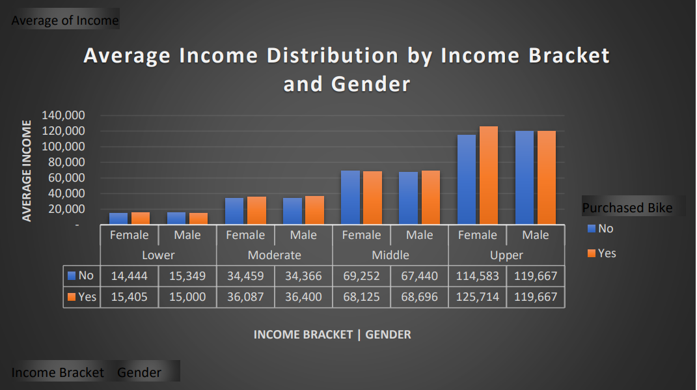
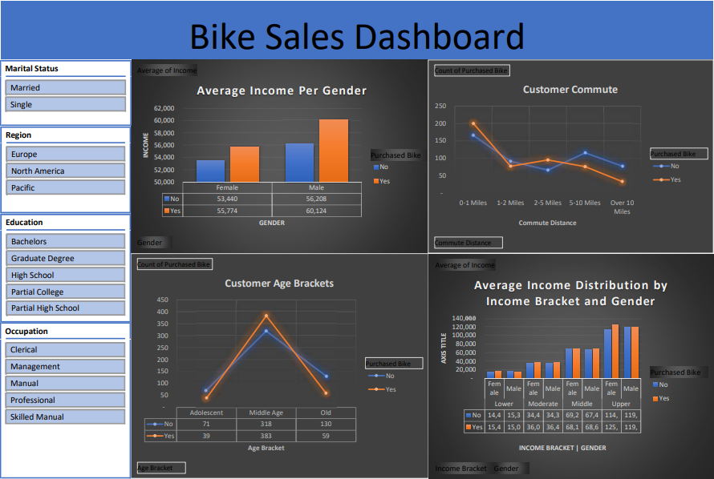

# Understanding Factors Influencing Bike Purchases

### Project Overview
---
This data analysis project aims to investigate the factors that influence whether a customer purchases a bike or not. The dataset includes information about customer characterists and purchase decisions.

### **ASK**
---
This phase involves defining the issue to be solved, identifying stakeholders and what their expectations from the project are.

Three questions will guide the future marketing program:

1. What Demographic Factors Influence Bike Purchases?
   
    - Explore the relationship between age, gender, and income levels of customers and their likelihood to purchase a bike.
  
    - Analyze if certain demographics are more inclined to make bike purchases.
  
3. How Does Customer Commute Distance Impact Bike Purchase Decisions?

   - Is there a correlation between the length of the customer commute and the likelihood of making a bike purchase?
     
   - Do customers with shorter commutes show a higher tendency to purchase bikes compared to those with longer commutes?

#### Business Task
Identify and understand the key factors influencing bike purchases to optimize marketing strategies.

#### Key Stakeholders
- **Marketting Analytics Team**: A team of data analysts who are responsible for collecting, analyzing, and reporting data that helps guide Cyclistic marketing strategy.
  
- **Executive Team**: The notoriously detail-oriented executive team will decide whether to approve the recommended marketing program.
  

### **PREPARE**
---
Involves collecting data and information and ensuring it satisfies necessary parameters.

#### Data Location, Licensing, and Privacy
The data has been made available on Github at this [link](https://github.com/AlexTheAnalyst/Excel-Tutorial/blob/main/Excel%20Project%20Dataset.xlsx) under this [license](). 

For privacy purposes, the rider’s personally identifiable information has been excluded from the data.

#### Data Organization
The data used for this analysis is the past 12 months from November 2020 to October 2021. Each month contains hundreds of thousands of rows and 13 columns.

#### Bias and Credibility
The data satisfies the ROCCC standard which means that it is reliable, original, comprehensive, current, and cited.

#### Data Limitations
The dataset contained one null value that was deleted and hence not used in the analysis.

### PROCESS
---
This phase of the analysis process includes cleaning the data and making sure it is fit for purpose. As well as making any modifications necessary.

Exel was used for the data processing phase of this project.

A summary of the cleaning and manipulation done to the data is presented below:

#### Changes
1. Found and removed one blank row (Used Conditional formatting, countblank function and Find&Select tool on the menu bar for this task).
2. Checked and verified the length of characters in the Ride_id column (Used the Len() function for this task).
4. Trimed Coumns to remove whitespaces and replaced entire columns by pasting only values (Use Trim() function for this task).

#### New
1. Created a new column to calculate ride_length (ended_at - started_at) and changed datatype to Time datatype.
2. Created a new column to extract day_of_week (1 = Sunday and 7 = Saturday) and changed datatype to General (Used the weekday() function for this task).
3. Created a new column to extract the date start_date from date-time datatype (Used the int() function for this task).

### **ANALYZE**
---
In this phase we analyze the data using statistical methods to find patterns, relationships, and trends.

Excel was used for the data analysis phase of this project.

**Outlined below are the key takeaways derived from the analysis of the data:**

1. The chart below reveals a consistent trend where more men than women buy bikes across all income levels. On average, males have higher incomes than females. It also indicates that individuals with higher incomes, both males and females, are more inclined to purchase bikes. Notably, females with an average income exceeding $55k and males with an average income surpassing $56k demonstrate a heightened likelihood of bike purchases.

   

   

---

2. The data reveals a clear downward trend in bike purchases as commute distances increase, attributed to the decreasing practicality of cycling over longer distances. Short commutes of 0-1 mile exhibit high bike purchase rates, suggesting a preference for cycling in easily navigable distances. Moderate commutes of 2-5 miles show fewer bike purchases, indicating decreased feasibility for walking or biking. Long commutes exceeding 10+ miles have low bike purchase rates, likely due to the challenges of covering such distances without the aid of car transportation.
   
      

      

---

3. The data indicates a low bike purchase rate among adolescents. A significant peak in bike purchases is observed for the middle-aged demographic. In contrast, older individuals exhibit a low bike purchase rate. Overall, there is a distinct age-related pattern, with middle-aged individuals showing the highest propensity for bike purchases compared to adolescents and the elderly.

      

      

---

4. In the upper income bracket, female bike buyers exhibit average earnings surpassing their male counterparts by 5.1%. Notably, there is a peak in women's bike purchases within this income range, implying that women in the upper income bracket could be an ideal target market.

      

---

### **SHARE**
---
The outcomes are effectively communicated with pertinent stakeholders. The execution stage of this project was carried out utilizing Excel for analysis for crafting insightful visual representations.

Dashboards created with visualizations also present relevant information at a glance.
      

### **ACT**
---
Upon completion of data processing, analysis, and insight dissemination, the conclusive phase involves formulating a well-aligned course of action for the bike-share enterprise, congruent with its business goals and mission. My recommendations are as follows:

1. Targeting high-income professional women as a prime segment for growth.
The data indicates that income level strongly correlates with bike purchasing behavior. Since high earning men already purchase bikes at high rates, develop marketing campaigns specifically tailored to attract high-income women to purchase bikes to increase overall market share.

2. Developing marketing campaigns and bike models catered specifically to middle-aged customers.
Based on the finding that middle-aged individuals have the highest bike purchase rate compared to adolescents and the elderly there is a clear opportunity to double down on meeting their needs and preferences. I would suggest conducting market research to identify the key priorities and values of middle-aged bike customers, such as comfort, durability and performance.

3. Developing a marketing campaign focused on high-earning professional women to further boost bike purchases within this income demographic.
Based on the finding that upper income bracket women have 5.1% higher average earnings than men and already show a peak in bike purchases implies upper income women have untapped potential as a cycling consumer base. I suggest conducting additional research to uncover the priorities, values, and preferences of this demographic regarding bikes and cycling. Use those insights to shape product design, branding, advertising and partnerships tailored to affluent career-driven women.

4. Targeting multi-modal transportation solutions for moderate 2-5 mile commutes to boost bike purchases.
The data indicates short commutes already strongly prefer cycling, while long distances over 10 miles pose inherent biking adoption challenges. However, the 2-5 mile bracket appears to have untapped potential if bicycling can be made more feasible through strategic partnerships.

### **CONCLUSION**
Throughout the duration of this project, I have effectively utilized Excel to carry out tasks such as data cleansing, processing, analysis, and data visualization. These efforts have enabled me to extract valuable insights from the data in alignment with the principles of the Google Data Analytics Certification program.
    

### REFERENCES

Sagnik Chand: Google Data Analytics Capstone Project- Cyclistic Bike-share Case Study [LINK](https://medium.com/@lesagnik/google-data-analytics-capstone-project-cyclistic-bike-share-case-study-d01df70748b)
      

